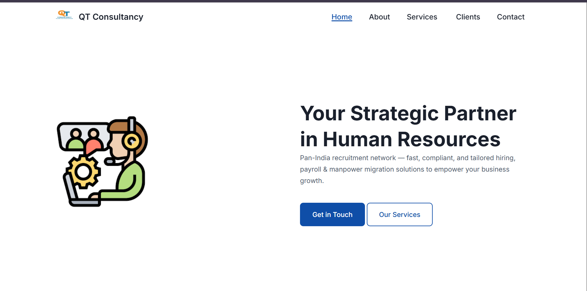

# 🌐  QT Consultancy

[]()
[]()
[]()
[]()

A simple and responsive **Company Website** built with **HTML, CSS, and JavaScript**.  
This project is designed for showcasing a company’s profile, services, and contact details.  

---

## 🚀 Features
- ✅ Responsive design (mobile & desktop)
- ✅ Company profile and about section
- ✅ Services showcase
- ✅ Contact form with validation
- ✅ Clean and customizable structure

---

## 🚀 Live Demo
👉 [Click Here to View Website](https://rupambhardwaj4.github.io/QT-consultancy/)

---

## 📂 Project Structure

company-website/
│── assets/
│ ├── images/
│ │ ├── logo.png
│ │ ├── banner.png
│ │ └── about.png
│ ├── css/
│ │ └── style.css
│ └── js/
│ └── script.js
│── index.html
│── README.md


---

## 🖼️ Preview  

### 🔹 Homepage  
  

### 🔹 Service Section  
  

### 🔹 Company Logo  
  

---

## 🛠️ Built With
- **HTML5** – Page structure  
- **CSS3** – Styling & responsiveness  
- **JavaScript** – Dynamic interactions  

---

## 📥 Installation & Usage
1. Clone the repository:
   ```bash
   git clone https://github.com/rupambhardwaj4/QT-consultancy.git
   cd QT-consultancy
   ```
🤝 Contributing

Contributions, issues, and feature requests are welcome!
Feel free to open a pull request.

⭐ Show Your Support

If you like this project, please give it a star ⭐ on GitHub!
